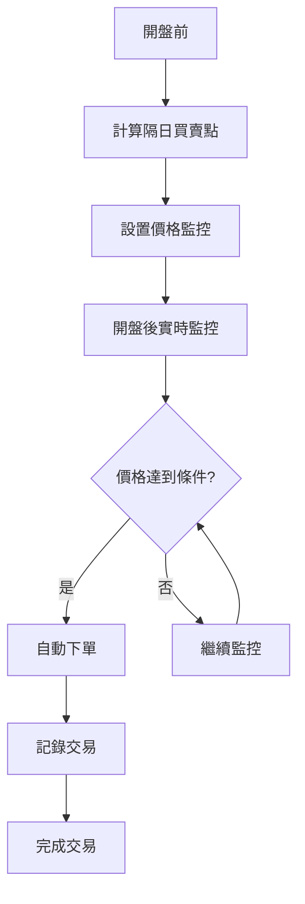

# 自動交易系統使用指南

## 📋 概述

本系統基於富邦證券新一代 API 實現自動化程式交易，使用藍綠橘交易策略進行股市交易決策和執行。

## 🚀 快速開始

### 1. 環境準備

```bash
# 安裝依賴
pip install -r requirements.txt

# 啟動數據庫
docker-compose up -d postgres redis
```

### 2. 配置 API 憑證

在 `config.yaml` 中配置富邦證券 API：

```yaml
fubon:
  base_url: 'https://api.fubon.com.tw'
  api_key: 'YOUR_ACTUAL_API_KEY' # 填入實際的 API Key
  api_secret: 'YOUR_ACTUAL_API_SECRET' # 填入實際的 API Secret
  timeout: 30
  trading:
    max_order_amount: 100000 # 最大單筆訂單金額
    min_order_quantity: 1000 # 最小訂單數量
    max_positions: 5 # 最大同時持倉數
```

### 3. 測試 API 連接

```bash
python scripts/trading/test_fubon_api.py
```

## 🔄 自動交易流程

### 完整流程圖



### 詳細步驟

1. **策略信號計算**

   - 使用歷史數據計算技術指標
   - 生成明天的買賣點信號
   - 設置價格監控條件

2. **實時價格監控**

   - 每分鐘檢查一次價格變化
   - 每 10 秒檢查一次系統狀態
   - 監控到收盤時間（13:30）

3. **自動下單執行**
   - 檢測到符合條件的價格
   - 計算合適的買賣數量
   - 執行實際下單或模擬交易

## 🛠️ 使用方式

### 模擬模式（推薦先用）

```bash
# 運行自動交易（模擬模式）
python scripts/trading/run_auto_trading.py
```

### 真實交易模式

```bash
# 確保已配置有效的 API 憑證
python scripts/trading/run_auto_trading.py
```

## 📊 交易策略

### 藍線多頭策略

- **入場條件**：價格站上藍線且呈正斜率
- **出場條件**：連續 3 根 K 線無法站上藍線

### 藍線空頭策略

- **入場條件**：價格跌破藍線且呈負斜率
- **出場條件**：連續 3 根 K 線站回藍線上

## 🔧 配置選項

### 技術指標參數

```yaml
indicators:
  ma_blue_period: 20 # 藍線週期
  ma_green_period: 60 # 綠線週期
  ma_orange_period: 120 # 橘線週期
  deviation_threshold: 0.05 # 乖離率閾值
```

### 交易參數

```yaml
strategies:
  blue_long:
    enabled: true
    max_positions: 3
    stop_loss: 0.05
    take_profit: 0.10
  blue_short:
    enabled: true
    max_positions: 3
    stop_loss: 0.05
    take_profit: 0.10
```

## 📈 監控和日誌

### 日誌文件

- `logs/auto_trading.log` - 自動交易日誌
- `logs/test_fubon_api.log` - API 測試日誌

### 監控指標

- 交易信號數量
- 成功下單率
- 平均執行時間
- 錯誤率統計

## ⚠️ 風險控制

### 資金管理

- 單筆訂單最大金額限制
- 最大同時持倉數限制
- 停損停利機制

### 錯誤處理

- 網絡異常自動重試
- API 失敗降級處理
- 交易異常記錄

## 🔍 故障排除

### 常見問題

1. **API 連接失敗**

   - 檢查 API 憑證是否正確
   - 確認網絡連接正常
   - 檢查防火牆設置

2. **下單失敗**

   - 檢查帳戶餘額
   - 確認股票代碼正確
   - 檢查交易時間

3. **策略信號異常**
   - 檢查歷史數據完整性
   - 確認技術指標計算
   - 檢查策略參數設置

### 調試工具

```bash
# 測試 API 連接
python scripts/trading/test_fubon_api.py

# 測試策略計算
python scripts/trading/test_auto_trading.py

# 查看日誌
tail -f logs/auto_trading.log
```

## 📚 參考資料

- [富邦證券 API 教學](https://github.com/Tradepm/-API/tree/main/20240418_%E6%96%B0%E4%B8%80%E4%BB%A3API_Python%E8%87%AA%E5%8B%95%E4%B8%8B%E5%96%AE%E5%B0%8F%E5%B9%AB%E6%89%8B)
- [藍綠橘交易策略說明](docs/strategies/STRATEGY_GUIDE.md)
- [技術指標計算說明](docs/indicators/TECHNICAL_INDICATORS.md)

## 🆘 支援

如有問題，請檢查：

1. 日誌文件中的錯誤信息
2. API 憑證配置
3. 網絡連接狀態
4. 交易時間設置

---

**⚠️ 重要提醒：**

- 請在模擬環境中充分測試後再進行真實交易
- 了解交易風險，謹慎使用自動交易功能
- 定期檢查系統運行狀態和交易記錄


