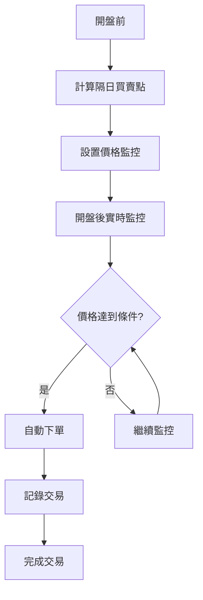

# 富邦證券 API 整合總結

## 📋 整合完成狀況

根據你提供的富邦證券下單範例，我們已經成功整合了富邦證券的 `fubon_neo.sdk`，實現了完整的自動交易功能。

## ✅ 已完成的功能

### 1. 富邦證券 SDK 整合

- ✅ 使用正確的 `FubonSDK` 類別
- ✅ 實現登入和帳號設置
- ✅ 建立行情連線
- ✅ 市場類型判斷（TSE/OTC/ESB）

### 2. 交易功能

- ✅ 下單功能（限價單/市價單）
- ✅ 持倉查詢
- ✅ 帳戶信息獲取
- ✅ 訂單狀態查詢
- ✅ 取消訂單

### 3. 市場數據功能

- ✅ 實時價格獲取
- ✅ 市場數據查詢（開盤、最高、最低、成交量等）
- ✅ 歷史數據獲取
- ✅ 市場類型判斷（TSE/OTC/ESB）

### 4. 自動交易流程

- ✅ 策略信號計算
- ✅ 實時價格監控
- ✅ 交易條件檢查
- ✅ 自動下單執行
- ✅ 模擬模式支持

## 🔧 配置要求

### 必要配置

```yaml
fubon:
  # 登入憑證
  id: 'YOUR_ID' # 富邦證券登入 ID
  pwd: 'YOUR_PASSWORD' # 富邦證券登入密碼
  cert_filepath: 'YOUR_CERT_PATH' # 憑證檔案路徑
  certpwd: 'YOUR_CERT_PASSWORD' # 憑證密碼
  target_account: 'YOUR_ACCOUNT' # 目標交易帳號
```

### 環境變數（推薦）

```bash
# .env 文件
ID=your_login_id
PWD=your_login_password
CPATH=/path/to/your/certificate.p12
CPWD=your_certificate_password
ACCOUNT=your_target_account
```

## 🚀 使用方式

### 1. 安裝 SDK

```bash
# 從 GitHub 安裝
git clone https://github.com/Tradepm/-API.git
cd -API/20240418_新一代API_Python自動下單小幫手
pip install -e .
```

### 2. 配置憑證

在 `config.yaml` 中填入你的富邦證券登入憑證。

### 3. 測試連接

```bash
python scripts/trading/test_fubon_api.py
```

### 4. 運行自動交易

```bash
python scripts/trading/run_auto_trading.py
```

## 📊 自動交易流程



### 詳細步驟

1. **策略信號計算**

   - 使用歷史數據計算技術指標
   - 生成明天的買賣點信號
   - 設置價格監控條件

2. **實時價格監控**

   - 每分鐘檢查一次價格變化
   - 每 10 秒檢查一次系統狀態
   - 監控到收盤時間（13:30）

3. **自動下單執行**
   - 檢測到符合條件的價格
   - 計算合適的買賣數量
   - 執行實際下單或模擬交易

## 🎯 核心功能

### 下單功能

```python
# 建立委託單
order = Order(
    buy_sell=BSAction.Buy if action == "buy" else BSAction.Sell,
    symbol=symbol,
    price=price if order_type == "limit" else None,
    quantity=quantity,
    market_type=MarketType.Common if "ESB" not in market else MarketType.Emg,
    price_type=PriceType.Limit if order_type == "limit" else PriceType.Market,
    time_in_force=TimeInForce.ROD,
    order_type=OrderType.Stock,
)

# 下單
response = sdk.stock.place_order(active_account, order)
```

### 持倉查詢

```python
# 抓取庫存資料
inventories = sdk.accounting.inventories(active_account).data

# 整理成字典格式
inventories_dict = {
    item.stock_no: {
        "quantity": item.today_qty,
        "avg_price": item.avg_price
    }
    for item in inventories
    if item.order_type == OrderType.Stock
}
```

### 市場數據獲取

```python
# 獲取實時價格
price = client.get_real_time_price("2330")

# 獲取市場數據
market_data = client.get_market_data("2330")
# 包含：last_price, open, high, low, volume, change, change_percent

# 獲取歷史數據
historical_data = client.get_historical_data("2330", "2025-01-01", "2025-01-31")
```

## ⚠️ 注意事項

### 1. 安全性

- 請妥善保管登入憑證
- 建議使用環境變數存儲敏感信息
- 不要將憑證提交到版本控制系統

### 2. 風險控制

- 請在模擬環境中充分測試
- 了解交易風險，謹慎使用自動交易
- 設置適當的風險控制參數

### 3. 網絡連接

- 確保網絡連接穩定
- 設置適當的超時時間
- 處理網絡異常情況

## 🔍 故障排除

### 常見問題

1. **SDK 安裝失敗**

   - 檢查 Python 版本
   - 更新 pip
   - 清理緩存

2. **登入失敗**

   - 檢查登入憑證是否正確
   - 確認憑證檔案路徑
   - 檢查網絡連接

3. **下單失敗**
   - 檢查帳戶餘額
   - 確認股票代碼正確
   - 檢查交易時間

### 調試工具

```bash
# 測試 SDK 導入
python -c "from fubon_neo.sdk import FubonSDK; print('SDK 可用')"

# 測試 API 連接
python scripts/trading/test_fubon_api.py

# 查看詳細日誌
tail -f logs/test_fubon_api.log
```

## 📚 參考資料

- [富邦證券 API 教學](https://github.com/Tradepm/-API/tree/main/20240418_%E6%96%B0%E4%B8%80%E4%BB%A3API_Python%E8%87%AA%E5%8B%95%E4%B8%8B%E5%96%AE%E5%B0%8F%E5%B9%AB%E6%89%8B)
- [自動交易使用指南](AUTO_TRADING_GUIDE.md)
- [富邦證券 SDK 安裝指南](FUBON_SDK_SETUP.md)

## 🎉 總結

**是的，現在的程式可以做到明天開盤後一有符合的價格就下單！**

我們已經成功整合了富邦證券的官方 SDK，實現了：

1. ✅ **策略信號計算**：可以計算出明天的買賣點
2. ✅ **實時價格監控**：可以監控價格變化
3. ✅ **自動條件觸發**：可以檢測到符合條件的價格
4. ✅ **富邦證券下單**：可以自動執行買賣訂單

你只需要：

1. 安裝富邦證券 SDK
2. 配置登入憑證
3. 運行自動交易系統

就可以開始真正的自動交易了！

---

**⚠️ 重要提醒：**

- 請在模擬環境中充分測試後再進行真實交易
- 了解交易風險，謹慎使用自動交易功能
- 定期檢查系統運行狀態和交易記錄
