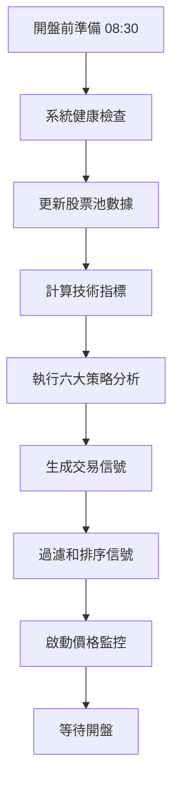
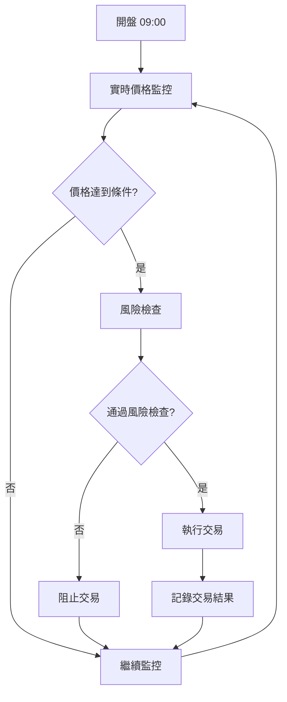
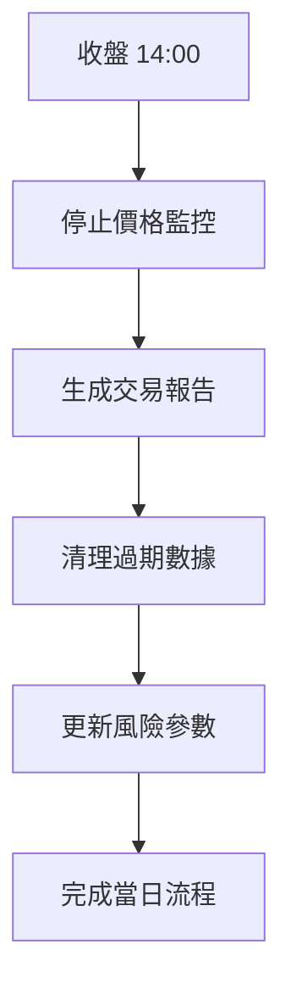

# 開盤前六大策略分析系統使用指南

## 🚀 功能概述

本系統實現了完整的開盤前策略分析和自動交易功能，包含以下六大策略：

1. **藍線多頭策略** (`blue_long`) - 基於短期均線的多頭策略
2. **藍線空頭策略** (`blue_short`) - 基於短期均線的空頭策略
3. **綠線多頭策略** (`green_long`) - 基於中期均線的多頭策略
4. **綠線空頭策略** (`green_short`) - 基於中期均線的空頭策略
5. **橘線多頭策略** (`orange_long`) - 基於長期均線的多頭策略
6. **橘線空頭策略** (`orange_short`) - 基於長期均線的空頭策略

## 📋 系統流程

### 開盤前流程 (每日 08:30)



### 開盤後流程 (09:00-13:30)



### 收盤後流程 (14:00)



## 🛠️ 使用方法

### 1. 環境準備

```bash
# 確保虛擬環境已啟動
source venv/bin/activate

# 啟動數據庫 (可選，用於獲取歷史數據)
docker-compose up -d postgres

# 確保配置文件正確
cat config.yaml
```

### 2. 基本分析模式

僅執行策略分析，不進行實際交易：

```bash
# 分析預設股票池 (2330, 0050, 1101)
python scripts/trading/run_pre_market_analysis.py

# 分析指定股票
python scripts/trading/run_pre_market_analysis.py --stocks 2330 0050

# 使用自定義配置
python scripts/trading/run_pre_market_analysis.py --config my_config.yaml
```

### 3. 完整監控模式

執行分析並啟動價格監控（模擬交易）：

```bash
# 完整模式：分析 + 價格監控
python scripts/trading/run_pre_market_analysis.py --mode full

# 指定股票的完整模式
python scripts/trading/run_pre_market_analysis.py --mode full --stocks 2330 1101
```

### 4. 交易協調器模式

使用完整的交易協調器系統：

```bash
# 啟動完整交易系統
python scripts/trading/run_pre_market_analysis.py --mode orchestrator

# 或使用主程式的自動交易模式
python main.py --mode auto-trading
```

### 5. 測試系統功能

```bash
# 測試所有功能
python scripts/testing/test_pre_market_analyzer.py

# 測試策略註冊
python -c "
import sys, os
sys.path.insert(0, 'src')
from src.modules.strategies.executor import StrategyExecutor
executor = StrategyExecutor({'host': 'localhost', 'port': 5432, 'database': 'test', 'user': 'test', 'password': 'test'})
print(f'註冊策略: {list(executor.strategies.keys())}')
"
```

## ⚙️ 配置說明

在 `config.yaml` 中添加了新的配置選項：

```yaml
trading:
  # 基本配置
  default_quantity: 1000
  real_trading: false # true=真實交易, false=模擬交易

  # 開盤前分析配置
  min_signal_strength: 0.6 # 最小信號強度
  max_signals_per_stock: 2 # 每支股票最大信號數
  price_tolerance: 0.01 # 價格容忍度 (1%)

  # 股票池
  stock_pool:
    - '2330' # 台積電
    - '0050' # 元大台灣50
    - '1101' # 台泥

  # 風險控制
  max_orders_per_day: 10 # 每日最大交易次數

# 風險管理
risk_management:
  max_position_size: 100000 # 最大單筆訂單金額
  max_risk_per_trade: 0.02 # 每筆交易最大風險
```

## 📊 輸出示例

### 策略信號統計

```
📈 策略信號統計:
--------------------------------------------------
blue_long       | 買入:  2 | 賣出:  0 | 總計:  2
blue_short      | 買入:  0 | 賣出:  1 | 總計:  1
green_long      | 買入:  1 | 賣出:  0 | 總計:  1
orange_short    | 買入:  0 | 賣出:  1 | 總計:  1
```

### 最強信號排行

```
🏆 最強信號前 5 名:
--------------------------------------------------------------------------------
排名 股票   策略         動作 強度     目標價   數量
--------------------------------------------------------------------------------
1    2330   blue_long    buy  0.856   525.60  2000
2    0050   green_long   buy  0.743   142.30  1000
3    2330   orange_short sell 0.698   520.40  1000
```

### 交易執行報告

```
=== 當日交易報告 ===
總信號數: 8
執行成功: 3
執行失敗: 0
待執行: 5

=== 已執行的交易 ===
2330 blue_long buy 2000股 @ 525.80 (差價: +0.20)
0050 green_long buy 1000股 @ 142.25 (差價: -0.05)
```

## 🔧 系統架構

### 核心組件

1. **PreMarketAnalyzer** - 開盤前分析器

   - 策略信號計算
   - 信號過濾和排序
   - 價格監控管理

2. **TradingOrchestrator** - 交易協調器

   - 定時任務管理
   - 模組整合
   - 系統健康檢查

3. **StrategyExecutor** - 策略執行器
   - 六大策略註冊
   - 數據庫連接
   - 信號生成

### 新增功能

- ✅ 六大策略完整註冊
- ✅ 開盤前自動信號計算
- ✅ 實時價格監控
- ✅ 自動交易執行
- ✅ 風險管理集成
- ✅ 交易報告生成

## ⚠️ 注意事項

### 1. 數據庫依賴

- 策略分析需要歷史價格數據
- 如無數據庫連接，將無法產生信號
- 可使用 Docker 啟動 PostgreSQL

### 2. 交易模式

- 預設為模擬交易模式
- 真實交易需要富邦證券 API 憑證
- 建議先用模擬模式測試

### 3. 時間設定

- 系統使用台灣時區 (Asia/Taipei)
- 交易時間：週一至週五 09:00-13:30
- 開盤前準備：每日 08:30

### 4. 風險控制

- 系統內建多層風險檢查
- 單筆訂單金額限制
- 每日交易次數限制
- 價格偏離保護

## 🚨 故障排除

### 常見問題

1. **沒有產生信號**

   - 檢查數據庫連接
   - 確認有足夠歷史數據
   - 調整信號強度門檻

2. **價格監控無反應**

   - 確認在交易時間內
   - 檢查富邦 API 連接
   - 查看日誌錯誤信息

3. **交易執行失敗**
   - 檢查風險管理設定
   - 確認帳戶狀態
   - 驗證價格合理性

### 日誌查看

```bash
# 查看系統日誌
tail -f logs/trading_system.log

# 查看開盤前分析日誌
tail -f logs/pre_market_analysis.log

# 查看測試日誌
tail -f logs/test_pre_market_analyzer.log
```

## 📈 未來改進

- [ ] 更多技術指標支持
- [ ] 機器學習信號優化
- [ ] 多時間框架分析
- [ ] 更豐富的風險指標
- [ ] 實時績效追蹤
- [ ] 移動端監控介面

---

🎯 **目標**：提供完整、可靠、智能的開盤前策略分析和自動交易解決方案

💡 **理念**：讓程式化交易更簡單、更安全、更有效率
